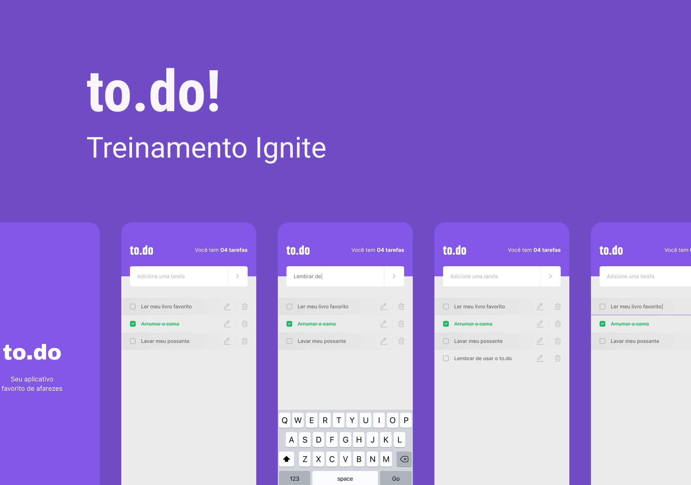

# ToDo

\
\
Este é um projeto com algumas funcionalidades prontas, onde o desafio é finalizar a aplicação, o mesmo é um dos desafios que são realizados durante a trilha de React Native para treinar o que foi aprendido até o momento.\
O projeto e desenvolvido através da cli do [React Native](https://reactnative.dev/), tem como objetivo o desenvolvimento de uma aplicação de lembretes de tarefas, que funcionalidades a cricação de contagem de tarefas, adicionar tarefas, alterar a descrição das tarefas, remover tarefas, marcar e desmarcar tarefas concluidas.

## Iniciar um Projeto React Native
### Devemos ter instalado as seguintes ferramentas:
* [Nodejs](https://nodejs.org/en/) together with Npm*
    * Sempre instalar a vesão LTS(LONG TIME SUPORT)
* [Yarn](https://yarnpkg.com/)(Não é necessário ter)

### Tecnologias utilizadas
* React Native
* Javascript

## Introdução para criar uma aplicação com o React Native
Este projeto foi inicializado com [React Native App](hhttps://reactnative.dev/).

### Scripts Disponíveis
Instale todas as dependências da aplicação no diretório do projeto\
`yarn` ou `npx install`
#### Para configurar o emulador do Android recomendo o Tutorial da Rocketseat 
[Ambiente React Native](https://react-native.rocketseat.dev/)
#### No diretório do projeto, você pode executar:
Para inicializar a aplicação no Windows e no Mac:\
`yarn Android` ou `npx run-android`\
Para inicializar no Linux:\
`yarn start` e em outro terminal `yarn android`\
`npx start ` e em outro terminal `npx run-android`

[Linkedin](www.linkedin.com/in/rafael-rocha-dos-santos-7b133410b)